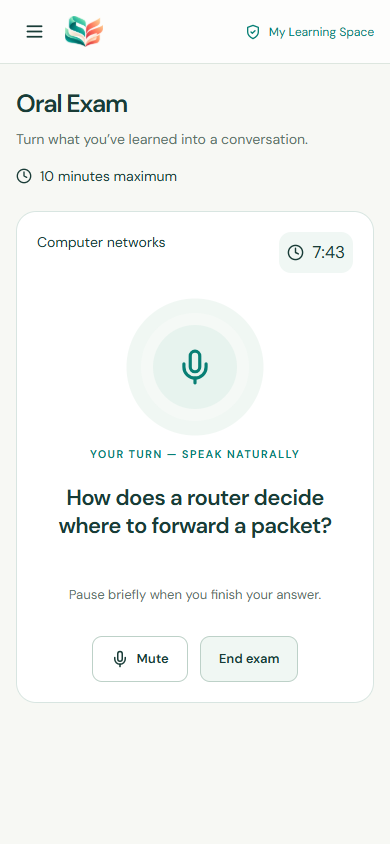
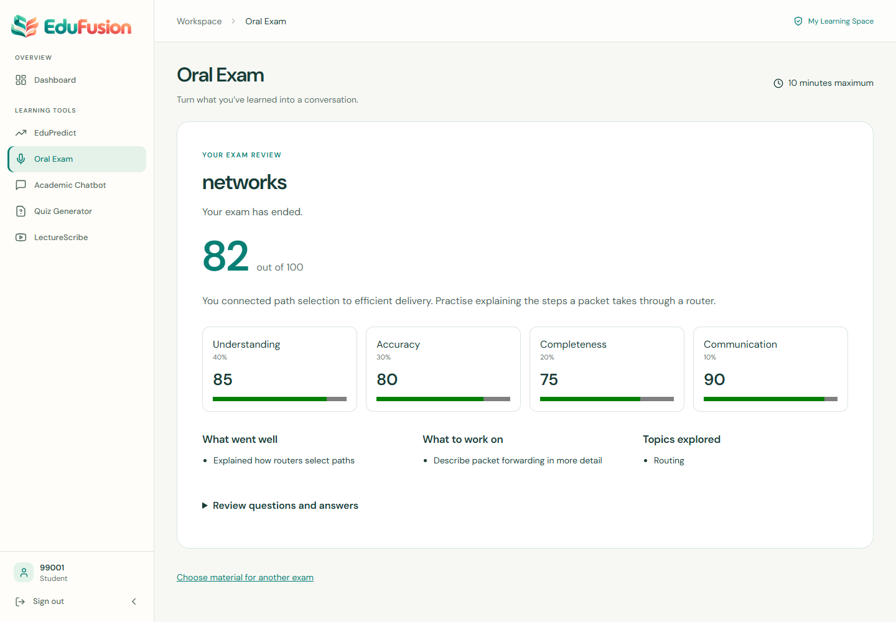
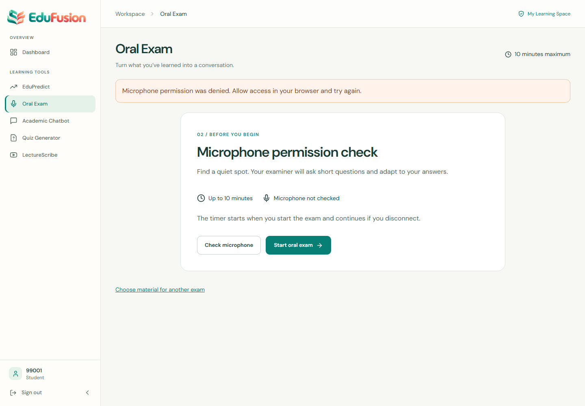

# Oral Exam verification — 2026-09-28

Implemented on `codex/realtime-oral-exam` in unmerged PR #10. This record covers both the original isolated browser checks and the 2026-09-28 production cutover and live verification. No secret values or connection strings are recorded here.

## Automated checks

| Check | Result |
| --- | --- |
| Baseline `npm run check` | Passed: 54 backend and 32 frontend tests, lint and build |
| Final `npm run check` | Passed: 69 backend and 38 frontend tests (107 total), lint and production build |
| Existing Python lecture-engine tests | Passed: 11 tests |
| Backend/frontend production dependency audits | Passed: zero reported vulnerabilities |
| Whitespace validation | `git diff --check` passed |
| Separate TypeScript check | Not applicable: JavaScript/JSX repository, no configured typecheck |

After merging the latest `main` into the PR branch, CI passed 69 backend tests, 39 frontend tests, 11 Python tests, lint, production build, and both production dependency audits. A final CI run is required for this documentation update.

New tests exercise migrated PostgreSQL-compatible PGlite databases, real HTTP routes and WebSocket connections. They cover authentication and ownership, owned lecture chunks, idempotent starts, concurrent-session exclusion, fixed ten-minute expiry, disconnected expiry, lease fencing, transcript persistence before model work, duplicate turns, bounded and validated model output, report retry, provider adapter failures, and database failures. Frontend tests cover preparation, denied microphone permission, start/end/results, reconnect without restarting, failed evaluation, and unsupported upload formats.

## Browser verification

Chrome was driven through Playwright against the isolated `verifyOralExam.js` fixture and the real Vite frontend. The fixture uses real authentication, migrations, API routes, microphone AudioWorklet, WebSocket transport, audio decoding and playback. Only provider responses and the microphone input are deterministic test fixtures. The account and source text are synthetic.

- Signed in, opened Oral Exam from the existing navigation, pasted material, prepared a session, checked the microphone and started the exam.
- Exercised microphone PCM frames through the socket, a committed transcript, a follow-up question and audible-playback completion handling with a generated tone.
- Uploaded a TXT file through the file chooser and prepared another session.
- Muted the microphone, refreshed an active session and reconnected to its saved question. The displayed remaining time continued decreasing; it did not reset to ten minutes.
- Ended the session and displayed its persisted score breakdown, strengths, improvement guidance, topics and question history.
- Checked desktop and 390 × 844 mobile layouts. Mobile document width equaled viewport width (390 px), without horizontal overflow.
- Normal flow produced zero browser console errors or warnings; inspected API requests returned 200/201.
- Injected a browser `NotAllowedError` for `getUserMedia` to verify the visible permission-denied message. This was a simulated denial because Chrome's fake-media flags bypass the real permission prompt. The component test separately asserts that denial does not call the start endpoint.

### Screenshots

Live mobile exam:

Desktop feedback (deterministic fixture scores, not a real student evaluation):

Simulated microphone permission failure:

## Self-review and scope

Reviewed ownership checks, SQL constraints and timestamps, socket authentication, origin validation, provider error sanitization, cancellation, browser resource cleanup, source boundaries, and all integration changes. Review fixes included saving a final transcript before requesting model assessment, atomically completing an exam when no further question is returned, preventing an old socket from ending a newer connection's exam, allowing reconnect backoff to outlive a crashed lease, handling microphone device loss, and including an owned lecture selected outside the library's first page.

The implementation adapts Candidexa's voice transport and lifecycle patterns while retaining EduFusion's authentication, database migration framework, source ownership, dashboard and styling. No interview scoring model, separate user system, new cloud service, or unrelated refactor was introduced. The existing tests' migration counts were updated for the additive migration.

## Production cutover and live Oral Exam verification

- A fresh PostgreSQL 18 custom-format backup was checked with `pg_restore --list` before the old Render Free database was deleted. A replacement Free PostgreSQL 18 database in Oregon became Available. The full public schema and data were restored in one transaction. Before migration, all 19 table names, 34 indexes, 16 foreign keys, migration ledger 001–004, and key counts matched the old database: 1 application user, 28,797 students, 32,605 enrollments, and 767 predictions.
- The repository's official migration script applied `005_oral_exam.sql`. The new database has 21 public tables, 41 indexes, 19 foreign keys, ledger 001–005, and both Oral Exam tables. Test account cleanup returned application users to 1 and Oral Exam sessions/turns to 0.
- Render backend deployed PR #10 commit `a1d62c3b8c1f1f18891bcbf6cc87e4286808a165`; `/api/health` and `/api/ready` returned 200. Vercel backend production was redeployed against the replacement database and `/api/ready` returned 200. The PR #10 Vercel frontend preview was rebuilt and its assets include the Render Oral Exam API base. Both Vercel frontend production and preview returned 200; production remains on `main`.
- Groq, ElevenLabs STT, and ElevenLabs TTS were called successfully with the configured provider accounts. The configured Groq key did not offer the code's default model, so production sets `ORAL_EXAM_MODEL=openai/gpt-oss-120b`; a live JSON-mode request returned 200. ElevenLabs TTS returned MP3 audio and realtime STT reported `session_started`.
- A temporary application account logged in through the live Render API. A text-source exam was created and started with an exact 600-second database deadline. WebSocket generated a Groq question and ElevenLabs speech. After disconnect/reconnect, `expires_at` was unchanged. Synthetic speech decoded to PCM16 traversed ElevenLabs STT, triggered an adaptive next decision, and produced one persisted answered turn. Ending the exam produced a persisted final evaluation with status `ready`. The temporary account and its cascaded exam records were removed.
- Exact production/preview HTTP Origins received matching CORS headers; an unlisted Origin received none. A WebSocket upgrade from the unlisted Origin returned 403.

The previous 15-character `JWT_SECRET` failed current startup validation. It was rotated to one matching strong value on the Render and Vercel backends. Existing signed sessions require re-login. Other existing Render backend environment variables were preserved.

## Existing-service regression comparison

Current `main` is deployed on the existing Vercel backend; PR #10 is live on the Render backend. The three proxy route files and shared `backend/src/lib/upstream.js` are unchanged by PR #10, and the configured upstream URLs have identical values on both backends. The Oral Exam route is mounted after the existing routes.

| Existing health route | Current `main` production | PR #10 Render | Classification and evidence |
| --- | --- | --- | --- |
| Chatbot | 503 | 503 | **PRE-EXISTING**. The direct `iug-chatbot.onrender.com/health` request timed out after 35 seconds. Render logged an invalid upstream response. |
| Question Generator | Initially 504, then 200 | Initially 502, then 200 | **PRE-EXISTING transient upstream failure**. Direct upstream `/health` returned 200; both proxy routes recovered to 200 without a code or configuration change. |
| LectureScribe | 502 | 502 | **PRE-EXISTING**. Direct `lecturescribe.app/health` returned 530; both unchanged proxy routes returned 502. |

On both backends, readiness, registration courses, login/me, dashboard stats/risk/course stats, admin clock/risk counts, and lecture-study status returned 200. Render Oral Exam materials returned 200. These checks do not establish every external integration's business flow while its upstream health endpoint fails. No unrelated service or infrastructure was modified to mask those failures.

## Remaining limits

**Physical microphone browser verification remains manual.** Synthetic audio exercised the live provider chain but did not establish real device capture quality, Arabic/English speech quality, or audibility. The database timer invariant and reconnect behavior were checked, but a fully unattended ten-minute browser session was not run. Only TXT/pasted text and owned existing lecture transcripts are supported; PDF, Word and PowerPoint require export to text. Short TTS questions are buffered before playback and barge-in is not implemented. The Free Render database lifecycle and free-service sleeping remain operational considerations.
